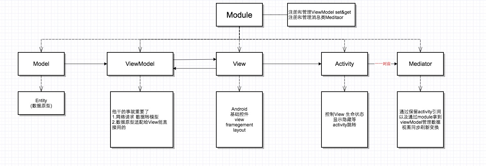
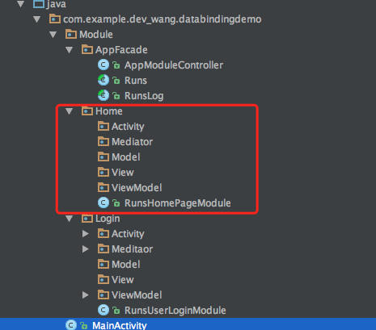

# PureMVC_AppFacade_Android

#####<font color="#272727" size = "3px">这是库是一个轻量级MVC为Android软件从头开始架构的，特点是轻、解耦、模块化，业务分离，简单实用</font>

#####<font color="#4590a3" size = "3px">This library is a lightweight MVC architecture for Android software from the ground up, featuring light, decoupling, modular, business separation, simple and practical.</font>

#####<font color="#272727" size = "3px">该库的设计主要有 Facade、Observer等，以及热插拔特性，充分给了我开发者注重业务开发逻辑注意力，而不用在意逻辑的分离与耦合</font>

#####<font color="#4590a3" size = "3px">The design of the library are Facade, Observer, etc., and hot-swap features, and give me the full attention of developers focus on business development logic, rather than care about the separation and coupling logic.</font>

####<font color="#000000" size = "6px">How To Get Started：</font>
#####<font color="#4590a3" size = "4px">第一步 初始化自定义模块控制类：用于注册模块和解注册模块</font>

#### <a name="AppModuleController">AppModuleController：</a>
######初始化和创建 <font color="#4590a3" size = "3px">AppModuleController</font>， 它继承自 <font color="#4590a3" size = "3px">Controller</font>
```java
public class AppModuleController extends Controller {
    @Override
    public void registerAllModules() {
        super.registerAllModules();
        //这里注册对应模块
        this.addOnceModuleClass(RunsUserLoginModule.class);
        this.addOnceModuleClass(RunsHomePageModule.class);
    }

    @Override
    public void unRegisterAllModules() {
        super.unRegisterAllModules();
        //这里解注册对应模块（最好位置与注册对应）
        this.removeModule(RunsUserLoginModule.class.getName());
        this.removeModule(RunsHomePageModule.class.getName());
    }
}
```
```java
public class MainActivity extends AppCompatActivity {
    private ActivityMainBinding activityMainBinding = null;
    public MainActivity() {
        super();
        //初始化调用 注册模块到模块管理类
        Facade.getInstance().init(new AppModuleController());
    }
}
```

#####<font color="#4590a3" size = "4px">第二步 创建模块文件夹目录（如图）</font>

######至于每个模块分别是什么职责一目了然





#####<font color="#4590a3" size = "4px">第三步 创建对应的功能模块，比如登录、主页等</font>
#### <a name="RunsUserLoginModule">RunsUserLoginModule</a>
######初始化和创建 <font color="#4590a3" size = "3px">RunsUserLoginModule</font>, 它继承自 <font color="#4590a3" size = "3px">Module</font>, 注册该模块需要的<font color="#4590a3" size = "3px">Mediator,ViewModel</font>, 以及移除解注册.
```java
public class RunsUserLoginModule extends Module {

    @Override
    public void onRegister() {
        this.registerMediatorClass(RunsUserLoginMediator.class);
        this.registerMediatorClass(RunsUserRegisterMediator.class);
        //
        this.registerViewModelClass(RunsUserLoginViewModel.class);
    }

    @Override
    public void onRemove() {
        this.removeAllMediator();
        this.removeAllViewModel();
    }
}
```
```java
public class RunsUserLoginMediator extends Mediator {

    @Override
    public void initializeMediator() {
        super.initializeMediator();
    }

    @Override
    public void handleNotification(INotification notification) {
        super.handleNotification(notification);
        String notificationName = notification.getName();

        if (notificationName.equals(Runs.BIND_VIEW_COMPONENT)) {
            Object object = notification.getObject();
            if (null != object) {
                this.setViewComponent(object);
                Toast.makeText((Context)object, Runs.BIND_VIEW_COMPONENT, Toast.LENGTH_SHORT).show();
            }
            return;
        }

        if (notificationName.equals(Runs.USER_LOGIN_NOTIFICATION)) {
			...
            return;
        }

        if (notificationName.equals(Runs.USER_REGISTER_NOTIFICATION)){
			...
            return;
        }

        if (notificationName.equals(Runs.USER_LOGOUT_NOTIFICATION)) {
			...
			return;
        }

    }

    @Override
    public String[] listNotificationInterests() {
        return new String[]{
        Runs.BIND_VIEW_COMPONENT,
        Runs.USER_LOGIN_NOTIFICATION,
        Runs.USER_LOGOUT_NOTIFICATION,
        Runs.USER_REGISTER_NOTIFICATION };
    }
}

```

```java
public abstract class Runs {

    public static final IFacade FACADE = Facade.getInstance();

    //RunsUserLoginMediator
    public static final String BIND_VIEW_COMPONENT = "BIND_VIEW_COMPONENT";
    public static final String USER_LOGIN_NOTIFICATION = "USER_LOGIN_NOTIFICATION";
    public static final String USER_LOGOUT_NOTIFICATION = "USER_LOGOUT_NOTIFICATION";
    public static final String USER_REGISTER_NOTIFICATION = "USER_REGISTER_NOTIFICATION";

    //RunsUserRegisterMediator
    public static final String BIND_REGISTER_COMPONENT = "BIND_REGISTER_COMPONENT";
    public static final String USER_BIND_PHONE_NOTIFICATION = "USER_BIND_PHONE_NOTIFICATION";
    public static final String USER_REGISTER_DONE_NOTIFICATION = "USER_REGISTER_DONE_NOTIFICATION";

}

```

```java

public class RunsUserLoginViewModel extends ViewModel {
    @Override
    public void setModel(Object model) {
        super.setModel(model);
    }

    @Override
    public void initializeViewModel() {
        super.initializeViewModel();
    }
}
```
####<font color="#000000" size = "6px">Usage：</font>
 1.根据注册名(Java中反射获取Class字符串)获取对应 **Mediator**（不常用）
 ```java
String className = RunsUserLoginMediator.class.getName();
RunsUserLoginMediator mediator = (RunsUserLoginMediator)Runs.FACADE.getMediatorWithName(className);
 ```
 2.根据注册名(Java中反射获取Class字符串)获取对应 **ViewModel**（常用）
```java
String className = RunsUserLoginViewModel.class.getName();
IViewModel viewModel = Runs.FACADE.getViewModelWithName(className);
```
 3.核心用法,消息派发.通过**sendNotification**方法，发出的消息会被对应监听的**Mediator**收听到而做对应的逻辑处理（核心）
```java
    @Override
    protected void onCreate(Bundle savedInstanceState) {
        super.onCreate(savedInstanceState);
        Runs.FACADE.sendNotification(Runs.BIND_VIEW_COMPONENT, this);

        activityMainBinding = DataBindingUtil.setContentView(this, R.layout.activity_main);
        activityMainBinding.login.setOnClickListener(new View.OnClickListener() {
            @Override
            public void onClick(View v) {
                Runs.FACADE.sendNotification(Runs.USER_LOGIN_NOTIFICATION);
                Intent intent = new Intent(MainActivity.this, RunsUserLoginActivity.class);
                startActivity(intent);
            }
        });

        activityMainBinding.register.setOnClickListener(new View.OnClickListener() {
            @Override
            public void onClick(View v) {
                Runs.FACADE.sendNotification(Runs.USER_REGISTER_NOTIFICATION);
            }
        });

        activityMainBinding.logout.setOnClickListener(new View.OnClickListener() {
            @Override
            public void onClick(View v) {
                Runs.FACADE.sendNotification(Runs.USER_LOGOUT_NOTIFICATION);
            }
        });
    }

```
### Security Disclosure

If you believe you have identified a security vulnerability with PureMVC_AppFacade_Android, you should report it as soon as possible via email to dev_wang@foxmail.com. Please do not post it to a public issue tracker.

## License

AFNetworking is released under the MIT license. See LICENSE for details.